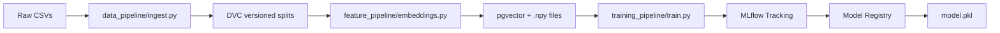
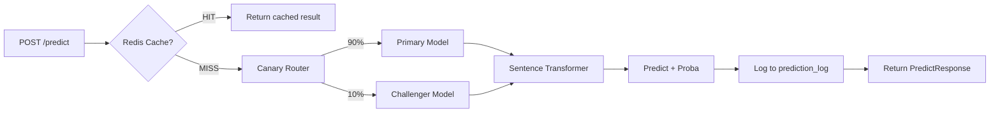
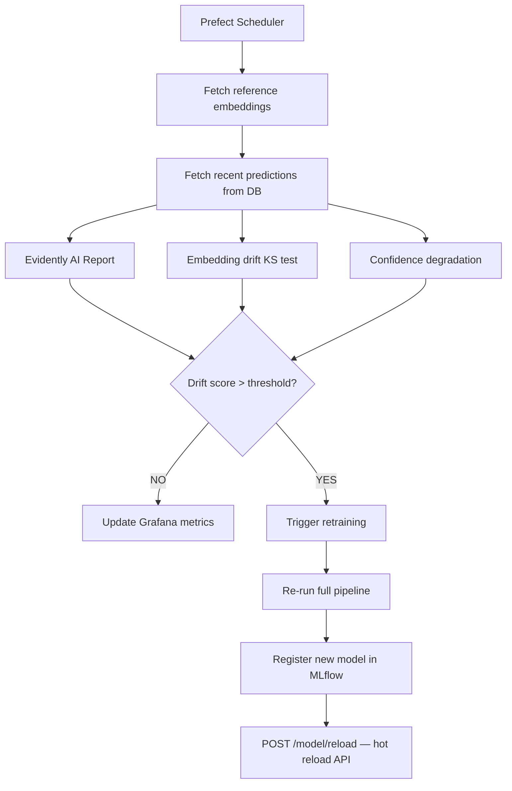

# 🔍 Fake News Trend Drift Detector

> **Production-grade MLOps pipeline for fake news detection with automated drift monitoring and retraining**

[](https://github.com/your-username/fake-news-mlops/actions)
[](https://www.python.org/downloads/)
[](https://fastapi.tiangolo.com/)
[](https://mlflow.org/)
[](LICENSE)

---

## 🏗️ Architecture Overview

```
┌─────────────────────────────────────────────────────────────────┐
│                        DATA LAYER                                │
│  Fake.csv ──► DVC Versioning ──► PostgreSQL + pgvector           │
└─────────────────────────────────────────────────────────────────┘
                              │
┌─────────────────────────────▼──────────────────────────────────┐
│                      PIPELINE LAYER                              │
│  Data Pipeline ──► Feature Pipeline ──► Training Pipeline        │
│  (clean/split)    (embeddings/index)   (LR/XGB + MLflow)        │
└─────────────────────────────────────────────────────────────────┘
                              │
┌─────────────────────────────▼──────────────────────────────────┐
│                     INFERENCE LAYER                              │
│  FastAPI ──► Embedding Service ──► Model Serving                 │
│  /predict    (Sentence Transformers  (canary + shadow            │
│  /batch      + Redis cache)           + rollback)                │
└─────────────────────────────────────────────────────────────────┘
                              │
┌─────────────────────────────▼──────────────────────────────────┐
│                  DRIFT & MONITORING LAYER                        │
│  Evidently AI ──► Auto Retrain ──► Prometheus + Grafana          │
│  (data/concept     (Prefect DAG     (metrics +                   │
│   drift reports)    + hot reload)    dashboards)                 │
└─────────────────────────────────────────────────────────────────┘
                              │
┌─────────────────────────────▼──────────────────────────────────┐
│                     INFRA & CI/CD LAYER                          │
│  Docker Compose ──► GitHub Actions ──► Streamlit Dashboard       │
└─────────────────────────────────────────────────────────────────┘
```

### Training Workflow



### Inference Workflow



### Monitoring Workflow



---

## 🚀 Quick Start

### Prerequisites

- Docker & Docker Compose
- Python 3.11+
- 8 GB RAM recommended (for embedding model)

### 1. Clone and configure

```bash
git clone https://github.com/your-username/fake-news-mlops.git
cd fake-news-mlops

# Create environment file
cp .env.example .env
```

### 2. (Optional) Add real data

Download from [Kaggle: Fake News Dataset](https://www.kaggle.com/datasets/clmentbisaillon/fake-and-real-news-dataset):
```bash
# Place in data/raw/
data/raw/Fake.csv
data/raw/True.csv
```

If you skip this step, the project uses **synthetic data** automatically — sufficient for demonstration.

### 3. Start all services

```bash
docker compose up --build
```

This starts:
| Service | URL | Description |
|---|---|---|
| FastAPI | http://localhost:8000 | Inference API |
| MLflow | http://localhost:5000 | Experiment tracking |
| Grafana | http://localhost:3000 | Dashboards (admin/admin) |
| Prometheus | http://localhost:9090 | Metrics |
| Streamlit | http://localhost:8501 | Interactive dashboard |
| Prefect | http://localhost:4200 | Orchestration |

### 4. Run the training pipeline

```bash
# Inside the api container or locally:
make pipeline

# Or step by step:
make ingest     # clean data → data/processed/
make features   # generate embeddings → pgvector + .npy
make train      # train model → models/model.pkl + MLflow
```

### 5. Make predictions

```bash
curl -X POST http://localhost:8000/predict \
  -H "Content-Type: application/json" \
  -d '{
    "title": "Government announces new policy",
    "text": "The Federal Reserve held interest rates steady on Wednesday, signaling it remains cautious about the evolving economic outlook."
  }'
```

**Response:**
```json
{
  "request_id": "a1b2c3d4-...",
  "prediction": "REAL",
  "label": 0,
  "confidence": 0.9231,
  "fake_probability": 0.0769,
  "real_probability": 0.9231,
  "drift_status": "normal",
  "model_version": "v1.0",
  "processing_time_ms": 12.4,
  "cached": false
}
```

---

## 📁 Project Structure

```
fake-news-mlops/
│
├── api/                          # FastAPI inference service
│   ├── main.py                   # All endpoints + rate limiting + caching
│   └── prediction_logger.py      # Async PostgreSQL prediction logging
│
├── data_pipeline/                # Data ingestion
│   └── ingest.py                 # Clean, split, save (DVC-versioned)
│
├── feature_pipeline/             # NLP feature generation
│   └── embeddings.py             # Sentence Transformers + pgvector storage
│
├── training_pipeline/            # Model training
│   └── train.py                  # Logistic Regression / XGBoost + MLflow
│
├── monitoring/                   # Drift detection
│   └── drift_detector.py         # Evidently AI + statistical drift tests
│
├── orchestration/                # Workflow automation
│   └── retrain_pipeline.py       # Prefect DAG: drift check → retrain → reload
│
├── observability/                # Metrics & dashboards
│   ├── prometheus/
│   │   ├── prometheus.yml        # Scrape config
│   │   └── alert_rules.yml       # Alerting rules
│   └── grafana/dashboards/
│       └── fakenews_dashboard.json
│
├── streamlit_app/
│   └── app.py                    # 4-page monitoring dashboard
│
├── tests/                        # pytest test suite
│   ├── conftest.py
│   ├── test_data_pipeline.py
│   ├── test_api.py
│   ├── test_drift_detector.py
│   └── test_training_pipeline.py
│
├── docker/
│   ├── Dockerfile.api
│   ├── Dockerfile.streamlit
│   ├── init_db.sql               # pgvector schema
│   └── grafana_datasources.yml
│
├── .github/workflows/
│   └── ci.yml                    # Lint → Test → Build → Push → Smoke test
│
├── configs/config.yaml           # Central configuration
├── docker-compose.yml
├── requirements.txt
├── Makefile                      # Developer shortcuts
└── README.md
```

---

## 🔌 API Reference

### `POST /predict`

Classify a single article.

| Field | Type | Description |
|---|---|---|
| `text` | `string` | Article body (required, min 10 chars) |
| `title` | `string` | Article title (optional) |

### `POST /batch_predict`

Classify up to 50 articles at once.

| Field | Type | Description |
|---|---|---|
| `texts` | `string[]` | Array of article bodies (1–50) |
| `titles` | `string[]` | Optional parallel array of titles |

### `GET /health`

Returns service liveness + readiness state.

### `GET /metrics`

Prometheus metrics in text format.

### `GET /drift/status`

Latest drift detection report (JSON).

### `POST /model/reload`

Hot-reload `models/model.pkl` without service restart.

---

## 📊 Drift Detection

### What is drift?

In production, the real world changes. A model trained on 2023 news may struggle with 2025 news patterns. **Drift** is the signal that this is happening.

### Three drift types we detect

| Type | Method | Threshold |
|---|---|---|
| **Data drift** | KS test on PCA of embeddings + Wasserstein distance | drift_score > 0.15 |
| **Concept drift** | Chi-squared test on prediction class distribution | shift > 0.10 |
| **Confidence drift** | Mean confidence drop between reference and current | drop > 0.10 |

### Evidently AI Reports

Each monitoring run generates:
- `reports/drift_report_<timestamp>.html` — full visual report
- `reports/latest_drift_status.json` — machine-readable status for the API

---

## 🔄 Auto-Retraining

When `overall_drift_score > 0.20`, the Prefect flow automatically:

1. Re-runs `data_pipeline/ingest.py`
2. Re-runs `feature_pipeline/embeddings.py`
3. Trains a new model via `training_pipeline/train.py`
4. Registers it in the MLflow Model Registry
5. Calls `POST /model/reload` to hot-swap the model with **zero downtime**

### Schedule the flow

```bash
# Run once
python orchestration/retrain_pipeline.py

# Deploy with 2-hour schedule (Prefect)
python orchestration/retrain_pipeline.py --schedule
```

---

## 🐳 Docker Services

All services start with one command:
```bash
docker compose up --build
```

### Environment variables

See `.env.example` for all configurable options. Key ones:

| Variable | Default | Description |
|---|---|---|
| `CANARY_TRAFFIC_PCT` | `0` | % traffic to challenger model |
| `SHADOW_MODE` | `false` | Log challenger predictions without serving |
| `RETRAIN_DRIFT_SCORE` | `0.20` | Drift score to trigger retraining |
| `EMBEDDING_MODEL` | `all-MiniLM-L6-v2` | Sentence Transformer model |

---

## 🧪 Running Tests

```bash
# All tests
make test

# With coverage
make coverage

# Specific module
pytest tests/test_api.py -v
pytest tests/test_drift_detector.py -v
```

Tests use mocks for the model and embedding service, so **no trained artifacts are required** in CI.

---

## 🎛️ Advanced Features

| Feature | Implementation |
|---|---|
| **Canary deployment** | `CANARY_TRAFFIC_PCT` env var; N% traffic to challenger model |
| **Shadow deployment** | `SHADOW_MODE=true`; challenger runs silently in parallel |
| **Model rollback** | `training_pipeline/train.py:rollback_model(run_id)` |
| **Rate limiting** | slowapi: 100 req/min per IP on `/predict`, 20/min on `/batch_predict` |
| **Prediction caching** | Redis: SHA256(text) → JSON, 1-hour TTL |
| **Feature store** | pgvector table with IVFFlat index for ANN search |
| **Async batch inference** | `/batch_predict` uses numpy vectorised embedding |
| **Hot model reload** | `POST /model/reload` swaps model.pkl in-process |
| **Request logging** | Every prediction logged to `prediction_log` table |

---

## 📈 Grafana Dashboards

Import `observability/grafana/dashboards/fakenews_dashboard.json` into Grafana (auto-provisioned via Docker).

Panels:
- Total predictions (1h)
- FAKE vs REAL distribution (pie chart)
- Drift score gauge (green/yellow/red)
- Inference latency P50/P95/P99 time series
- Prediction confidence distribution
- Request rate (req/min)
- Cache hit rate
- Retraining events counter

---

## 🗺️ Future Improvements

- [ ] **Online learning** — partial_fit updates from prediction feedback
- [ ] **UMAP drift visualisation** — 2D embedding space in Grafana
- [ ] **LLM-based classifier** — fine-tuned BERT/RoBERTa via HuggingFace
- [ ] **Multi-language support** — multilingual-MiniLM embedding model
- [ ] **Feedback loop API** — `POST /feedback` to correct wrong predictions
- [ ] **A/B test framework** — statistical significance testing for canary
- [ ] **Kubernetes deployment** — Helm chart for production scaling
- [ ] **Alertmanager integration** — Slack/PagerDuty alerts from Prometheus

---

## 🛠️ Tech Stack

| Layer | Technology |
|---|---|
| API | FastAPI + Uvicorn |
| ML | Scikit-learn, XGBoost, Sentence Transformers |
| MLOps | MLflow, DVC, Evidently AI |
| Orchestration | Prefect |
| Database | PostgreSQL + pgvector |
| Caching | Redis |
| Monitoring | Prometheus + Grafana |
| CI/CD | GitHub Actions |
| Containers | Docker + Docker Compose |
| Dashboard | Streamlit |

---

## 📄 License

MIT — see [LICENSE](LICENSE)

---

*Built as a production-grade MLOps portfolio project. Suitable for AI Engineer and MLOps Engineer interview showcases.*
